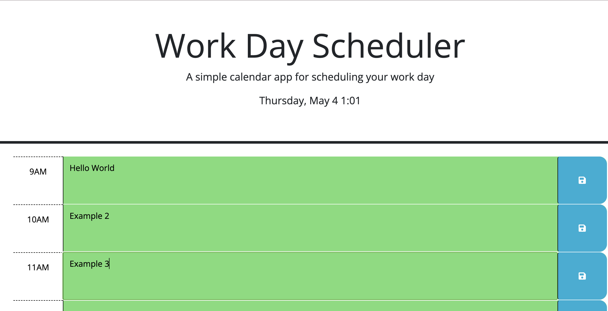

# Description
This program will display a planner with time blocks ranging from 9am-5pm. The user will be able to store plans in each block and the colors will change based on the time of day. The user is able to save their inputs with the save button, and upon refreshing the browser, the previous user input will persist.

## Installation
N/A

## Usage
Users need only a computer with a stable internet connection, and a list of tasks they may have in mind to input for their workday!
In order to use the program, the user simply needs to type in any of the time blocks and then hit the save button.
Deployed github URL: https://github.com/ALugo0823/work-day-planner

## Credits
N/A

## Built with
* JavaScript/JQuery
* CSS/Bootstrap
* HTML

## License
MIT License